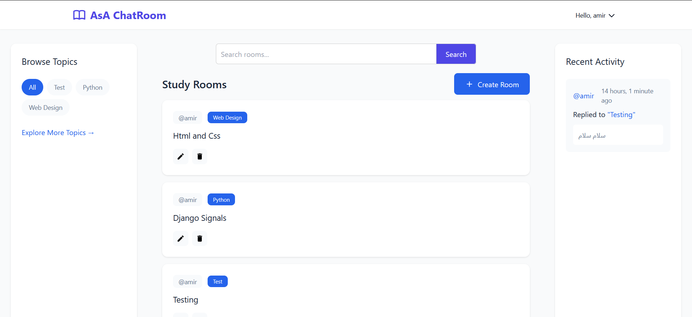

# 🗨️ Django-ChatRoom

A modern real-time chatroom application built with Django and WebSockets, offering an interactive messaging experience with advanced features. 🚀

🔗 **[Live Demo: Django-ChatRoom on Railway](https://chatroom-production-076b.up.railway.app/)**

## ✨ Features

- 🏠 **Room List**: Browse and filter available chat rooms.  
<br>

- 📌 **Sidebar Navigation**:  
    - Right Sidebar: Real-time activity feed showing latest messages.  
    - Left Sidebar: Channel topics for easy room filtering.  
<br>

- 🔐 **User Authentication**: Secure sign-up & login system.  
<br>

- 💬 **Advanced Messaging System**:  
    - Real-time message delivery using WebSockets.  
    - Message threading with reply functionality.  
    - Message editing and deletion.  
    - Message timestamps and edit history.  
    - Auto-scroll to latest messages.  
<br>

- 📂 **Room Management**:  
    - Create and customize chat rooms.  
    - Room moderation tools.  
    - Participant tracking.  
<br>

- 👤 **User Profiles**:  
    - Detailed user profiles.  
    - Activity history.  
    - Message and room management.  
    - Profile customization.  

<br>

## 🚀 Getting Started

### 🔧 Installation

1. **Clone the repository**:

    ```bash
    git clone https://github.com/ThadIAmir/ChatRoom.git
    cd ChatRoom
    ```

2. **Create a virtual environment**:

    ```bash
    python -m venv venv
    source venv/bin/activate  # On Windows: venv\Scripts\activate
    ```

3. **Install dependencies**:

    ```bash
    pip install -r requirements.txt
    ```

4. **Set up Redis (WSL)**:

    ```bash
    sudo apt update
    sudo apt install redis-server
    sudo service redis-server start
    ```

5. **Configure environment**:
    - Copy `.env.example` to `.env`
    - Update settings as needed.

6. **Run migrations**:

    ```bash
    python manage.py migrate
    ```

7. **Start the application**:

    ```bash
    python manage.py runserver
    ```

8. **Launch Daphne for WebSocket support**:

    ```bash
    python -m daphne ChatRoom.asgi:application
    ```

## 🛠️ Technology Stack

- **Backend**:
    - Django
    - Django Channels
    - WebSockets
    - Daphne ASGI server
- **Frontend**:
    - HTML5
    - CSS3
    - JavaScript 
- **Database**:
    - PostgreSQL
- **Infrastructure**:
    - Redis (Message broker)
    - WSL (Windows Subsystem for Linux)
    - Railway (Deployment)

## 🤝 Contribution

Contributions are welcome! Follow these steps to contribute:

1. Fork the repository.
2. Create a feature branch (`git checkout -b feature-branch`).
3. Commit your changes (`git commit -m "Add new feature"`).
4. Push to the branch (`git push origin feature-branch`).
5. Open a Pull Request.

## 📜 License

This project is licensed under the MIT License.

## 🌟 Acknowledgments

- [Django Channels documentation](https://channels.readthedocs.io/en/stable/)
- [Redis documentation](https://redis.io/documentation)
- [WebSocket protocol specifications](https://tools.ietf.org/html/rfc6455)

---

## 📸 Screenshots

Here are some screenshots of the Django-ChatRoom in action!

  
*Homepage interface.*

Enjoy real-time chatting! 🎉🚀
